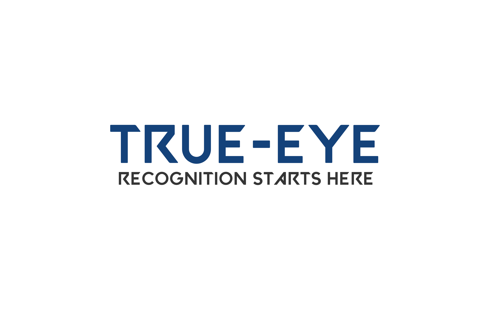

# TrueEye



TrueEye is a unique and powerful project that utilizes Convolutional Neural Networks (CNNs) to perform image segmentation and object recognition, enabling a deeper understanding of visual context. By combining these two cutting-edge techniques, TrueEye takes image analysis to new heights, providing advanced capabilities for various applications such as computer vision, autonomous systems, and more.

## Key-Features

- **Image Segmentation:** TrueEye leverages state-of-the-art CNN models to perform pixel-level image segmentation. This process involves identifying and classifying individual pixels in an image, enabling the accurate extraction of objects and their boundaries.
- **Object Recognition:** With the assistance of CNNs, TrueEye goes beyond image segmentation to recognize and categorize objects within a given scene. By training on large datasets, the model becomes adept at identifying a wide range of objects, enhancing the understanding of visual context.
- **Advanced Context Understanding:** By combining image segmentation and object recognition, TrueEye achieves a unique and comprehensive understanding of visual context. This holistic analysis allows for deeper insights into scenes, enabling more sophisticated applications in areas such as computer vision, robotics, and augmented reality.
- **Easy Integration:** TrueEye is designed with simplicity and ease of use in mind. The project provides a user-friendly API that allows developers to seamlessly integrate the image segmentation and object recognition capabilities into their own applications. The well-documented API makes it straightforward to implement TrueEye's functionalities in your projects.

## Installation

To set up TrueEye on your local machine, follow these steps:

1. Clone the repository:

```shell
git clone https://github.com/Syedkumailhaider512/trueeye.git
```

2. Install the required dependencies:

```shell
pip install -r requirements.txt
```

3. Start TrueEye

## Acknowledgements

TrueEye builds upon the remarkable work of researchers and developers in the fields of computer vision and deep learning. We would like to acknowledge the contributions of the following projects and datasets:

- __CNN:__ - Convolutional Neural Networks
- __CV2:__ - Python Computer Vision Library

We extend our gratitude to the open-source community for their continuous efforts in advancing computer vision and making powerful tools and datasets available to everyone

##License
TrueEye is released under the <u>MIT License</u>.


## Contact

For any inquiries or feedback, please contact the project team at [skumailhaiderhsp@gmail.com]

Feel free to customize this template to match your project's specific requirements and add any additional sections or information as needed. Remember to replace the `Syedkumailhaider512` placeholder in the installation instructions with your actual GitHub username.
